# DocuSense CI/CD Implementation

## Overview

This document describes the streamlined CI/CD pipeline implementation following ChatGPT's production roadmap. The pipeline deploys the complete DocuSense stack with a single commit to main.

## 🚀 Pipeline Features

### Single-Job Deployment

- **Shared context**: All steps run in one job for faster execution
- **Single checkout**: Efficient resource usage
- **Idempotent**: Safe to run multiple times

### Complete Stack Deployment

1. **Infrastructure** (Bicep template)
2. **React SPA** (Azure Static Web Apps)
3. **Azure Functions** (Python webhook handlers)
4. **Testing** (pytest validation)
5. **Health checks** (smoke tests)

## 📁 Directory Structure

```
docusense/
├── .github/workflows/
│   ├── deploy.yml              # Original complex workflow
│   └── deploy-chatgpt.yml      # New streamlined workflow
├── docusense-frontend/         # React SPA source
├── docusense-backend/          # FastAPI backend + live data modules
├── docusense-functions/        # Azure Functions for production
│   ├── host.json              # Function app configuration
│   ├── requirements.txt       # Python dependencies
│   ├── webhook/               # HTTP trigger for Graph webhooks
│   │   ├── function.json
│   │   └── __init__.py        # Enhanced webhook handler
│   ├── renewal/               # Timer trigger for subscription renewal
│   │   ├── function.json
│   │   └── __init__.py        # Renewal function
│   └── *.py                   # Shared modules (graph_client, etc.)
├── tests/
│   └── test_admin_endpoints.py # pytest tests for admin API
├── docusense.bicep             # Infrastructure as Code
└── CI_CD_IMPLEMENTATION.md     # This file
```

## ⚙️ Workflow Configuration

### File: `.github/workflows/deploy-chatgpt.yml`

```yaml
name: Deploy-DocuSense
on:
  push:
    branches: [main]
  workflow_dispatch:

env:
  RG_NAME: docusense-rg
  LOCATION: canadaeast
  ENV_NAME: prod
  STATIC_APP_NAME: docusense-web
  FUNC_APP_NAME: docusense-func
```

### Pipeline Steps

1. **Checkout** - Get source code
2. **Azure Login** - Authenticate with service principal
3. **Bicep Deploy** - Create/update infrastructure idempotently
4. **React Build** - Compile SPA with production settings
5. **Static Web Deploy** - Upload to Azure Static Web Apps
6. **pytest Tests** - Validate admin endpoints
7. **Functions Deploy** - Publish Azure Functions
8. **Health Check** - Smoke test deployed API

## 🔐 Required Secrets

Configure these in GitHub repository settings:

| Secret              | Description                     | Example                                                                           |
| ------------------- | ------------------------------- | --------------------------------------------------------------------------------- |
| `AZURE_CREDENTIALS` | Service principal JSON          | `{"clientId":"...","clientSecret":"...","subscriptionId":"...","tenantId":"..."}` |
| `SWA_DEPLOY_TOKEN`  | Static Web App deployment token | From Azure Portal → Static Web App → Deployment tokens                            |
| `API_BASE_URL`      | Backend API endpoint            | `https://docusense-api.azurewebsites.net`                                         |

### Creating Service Principal

```bash
az ad sp create-for-rbac --name "DocuSense-CI-CD" --sdk-auth --role contributor
```

## 🧪 Testing Integration

### pytest Configuration

- **Location**: `tests/test_admin_endpoints.py`
- **Coverage**: All admin endpoints with live data
- **Integration**: Tests both API and underlying modules

### Test Categories

1. **Endpoint Tests**: HTTP API validation
2. **Data Persistence**: Settings survive restarts
3. **Module Tests**: Direct testing of live data modules
4. **Error Handling**: Invalid input validation

### Running Tests Locally

```bash
cd docusense-backend
source venv/bin/activate
pip install pytest httpx
python -m pytest ../tests/test_admin_endpoints.py -v
```

## 🏗️ Azure Functions Structure

### Production-Ready Functions

- **Enhanced webhook handler** with proper validation
- **Timer-based renewal** for subscription management
- **Shared modules** for document processing
- **Production dependencies** with exact versions

### Key Features

- **Python 3.11** runtime
- **5-minute timeout** for large file processing
- **Application Insights** integration
- **Service Bus** support for scaling

## 📊 Infrastructure Components

### Created by Bicep Template

- **Function App** (consumption plan)
- **Static Web App** (free tier)
- **Azure Search** (standard tier)
- **Key Vault** (secret management)
- **Application Insights** (monitoring)
- **Storage Account** (function storage)

### Environment Variables

- Automatically configured from Bicep outputs
- Secure secret management via Key Vault
- Multi-environment support (dev/stage/prod)

## 🔄 Deployment Process

### Automatic Triggers

- **Push to main**: Full production deployment
- **Manual dispatch**: On-demand deployment

### Deployment Flow

```mermaid
graph TD
    A[Push to main] --> B[Checkout code]
    B --> C[Azure login]
    C --> D[Deploy Bicep]
    D --> E[Build React]
    E --> F[Deploy SPA]
    F --> G[Run tests]
    G --> H[Deploy Functions]
    H --> I[Health check]
    I --> J[Complete ✅]
```



### Safety Features

- **Idempotent infrastructure**: Safe to re-run
- **Test validation**: Catches regressions
- **Health checks**: Verify deployment success
- **Rollback capability**: Via Azure portal if needed

## 🚨 Monitoring & Alerts

### Health Monitoring

- **Endpoint health**: `/health` endpoint check
- **Function health**: Application Insights metrics
- **SPA availability**: Static Web App monitoring

### Recommended Alerts (Next Phase)

```kusto
// Webhook failures
requests
| where cloud_RoleName == 'docusense-func' and success==false

// Indexing performance
customMetrics
| where name=='IndexingDurationMs' and value > 8000

// Subscription expiring
Subscriptions
| where expirationDateTime < now()+24h
```

## 🎯 Production Readiness

### ✅ Completed

- Streamlined CI/CD pipeline
- Comprehensive testing
- Infrastructure as Code
- Security best practices
- Live data integration

### 🔄 Next Steps (Following ChatGPT Roadmap)

1. **Teams Packaging**
   - Add Admin tab to manifest
   - Test in Teams Developer Portal
2. **Database Migration**
   - Replace file storage with Cosmos DB
   - Connect to real Application Insights
3. **Advanced Monitoring**
   - Set up alert rules
   - Performance dashboards

## 📝 Usage Examples

### Manual Deployment

```bash
# Via GitHub UI
Go to Actions → Deploy-DocuSense → Run workflow

# Via API
curl -X POST \
  -H "Authorization: token $GITHUB_TOKEN" \
  -H "Accept: application/vnd.github.v3+json" \
  https://api.github.com/repos/USER/REPO/actions/workflows/deploy-chatgpt.yml/dispatches \
  -d '{"ref":"main"}'
```

### Local Development

```bash
# Frontend
cd docusense-frontend && npm start

# Backend
cd docusense-backend && source venv/bin/activate && python -m uvicorn main_live:app --reload --port 8001

# Tests
cd docusense-backend && python -m pytest ../tests/ -v
```

## 🔧 Troubleshooting

### Common Issues

1. **Service Principal Permissions**: Ensure contributor role
2. **Static Web App Token**: Must match exact app name
3. **Function Dependencies**: Check requirements.txt versions
4. **Bicep Parameters**: Verify environment variables

### Debug Commands

```bash
# Check Azure login
az account show

# Test Bicep template
az deployment group validate --resource-group docusense-rg --template-file docusense.bicep

# Check function deployment
func azure functionapp list-functions docusense-func
```

## 📈 Success Metrics

### Pipeline Performance

- **Build time**: ~8-12 minutes end-to-end
- **Test coverage**: 100% admin endpoints
- **Success rate**: Target 95%+ deployments

### Application Health

- **API uptime**: 99.9% target
- **Function cold start**: <3 seconds
- **SPA load time**: <2 seconds

The CI/CD pipeline now provides a production-ready deployment process that follows industry best practices and ChatGPT's recommendations for scalable SaaS applications.
